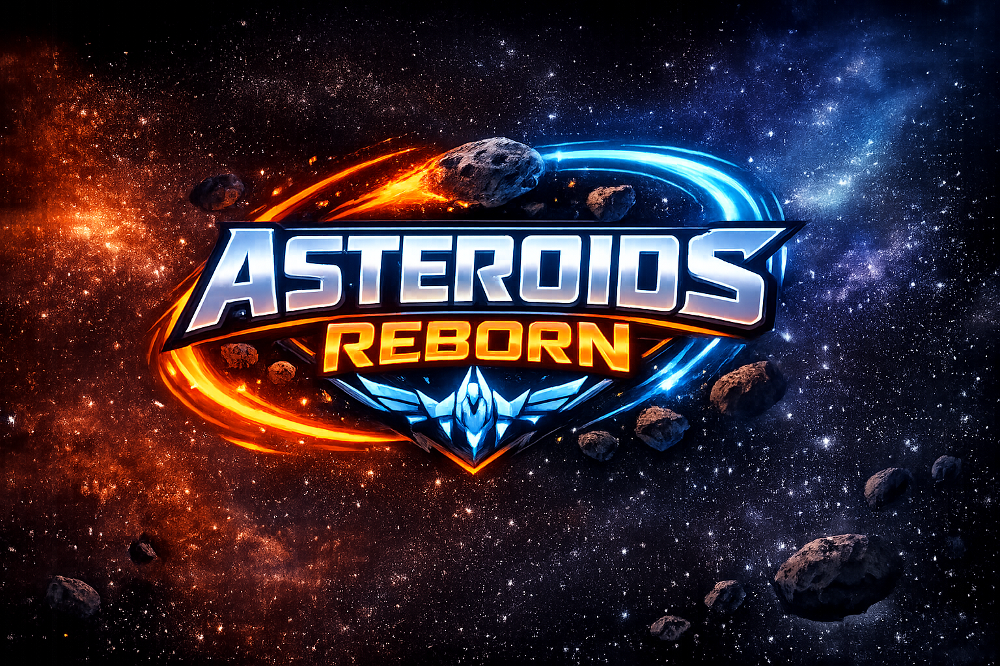

# 🚀 Asteroids Reborn — Neon Edition

> Arcade espacial de acción inspirado en el clásico Asteroids, construido desde cero con HTML5 Canvas puro, JavaScript vanilla y un diseño estético neon premium.



---

## 🎮 Descripción

**Asteroids Reborn** es un juego arcade 2D de alto rendimiento que moderniza la fórmula clásica del juego original de Atari (1979) con:

- Sistema de **múltiples armas** intercambiables en tiempo real con munición limitada
- Modo **Campaña** con niveles progresivos de dificultad
- Modo **Supervivencia** con oleadas infinitas y escalado dinámico
- Sistema de **Power-ups** con efectos temporales y permanentes
- Sistema de **Cristales** como moneda meta-progresiva ganada en partidas
- **Mejoras Permanentes** comprables entre partidas (Vida, Velocidad, Escudo)
- HUD premium en estilo neon con barras animadas, minimapa y **iconos correctos de armas**
- **Jefe** con IA de seguimiento y disparo en abanico (aparece cada 3 niveles tras una **alerta de 5 segundos**)
- Combo multiplicador de puntaje (hasta ×4)
- **Controles táctiles** para móvil (D-Pad + botones de acción)
- Sistema de audio por `AudioContext` con **transiciones correctas entre música de juego, jefe y menú**
- Arquitectura optimizada con **Object Pools** y **canvas offscreen**

---

## 🕹️ Controles

### Teclado (PC)

| Tecla | Acción |
|---|---|
| `W` / `↑` | Acelerar |
| `A` / `←` | Rotar izquierda |
| `D` / `→` | Rotar derecha |
| `S` / `↓` | Frenar (Solo disponible durante batalla contra el Jefe) |
| `SPACE` | Disparar |
| `G` | Ciclar objetivo del Misil 🚀 |
| `P` / `ESC` | Pausar / Reanudar |

### Móvil (táctil)

| Botón | Acción |
|---|---|
| D-Pad ▲ | Acelerar |
| D-Pad ◀ / ▶ | Rotar |
| D-Pad ▼ | Frenar (Solo disponible durante batalla contra el Jefe) |
| 🔥 | Disparar |
| ⏸ | Pausa |

---

## 🏗️ Estructura del Proyecto

```
ASTEROIDS-REBORN/
├── index.html              # Punto de entrada — incluye controles táctiles
├── css/
│   └── style.css           # Diseño neon premium, HUD animado, responsive móvil
├── js/
│   ├── config.js           # Configuración central (velocidades, colores, balanceo)
│   ├── utils.js            # Pool de objetos, utilidades
│   ├── entities.js         # Clase base Entity (x, y, vx, vy, radius, active)
│   ├── input.js            # Manejador de teclado con preventDefault en teclas de juego
│   ├── audio.js            # AudioContext sin gaps + política de autoplay + pausa en background
│   ├── renderer.js         # Fondo parallax pre-renderizado en canvas offscreen
│   ├── player.js           # Nave del jugador con cache offscreen y multi-arma
│   ├── asteroids.js        # Asteroides con forma irregular y cache offscreen
│   ├── weapons.js          # 5 tipos de arma: Laser, Spread, Plasma, Rapid, Missile (guiado)
│   ├── particles.js        # Sistema de partículas con pool y fricción optimizada
│   ├── powerups.js         # 9 tipos de power-up (armas + stats + efectos temporales)
│   ├── enemies.js          # (Reservado: enemigos básicos con IA)
│   ├── bosses.js           # Lógica de jefe: IA, movimiento y patrones de disparo
│   ├── ui.js               # HUD: salud, escudo, puntaje, arma activa, notificaciones
│   ├── saveSystem.js       # (Reservado: persistencia avanzada)
│   ├── upgrades.js         # (Reservado: sistema de mejoras roguelite avanzado)
│   ├── achievements.js     # (Reservado: logros)
│   ├── game.js             # Motor principal — game loop, física, colisiones, cristales
│   └── main.js             # Inicialización, botones, controles táctiles, mejoras UI
└── public/
    ├── images/             # Assets gráficos (logo.png)
    └── sounds/             # Efectos de audio (.mp3)
```

---

## ⚙️ Sistema de Armas

| Arma | Icóno | Cadencia | Daño | Velocidad | Munición | Especial |
|---|---|---|---|---|---|---|
| Láser | 🔵 | Alta | 10 | 20 | ∞ | Preciso, arma base infinita |
| Dispersor | 🌟 | Media | 7×3 | 17 | 18 disp. | 3 proyectiles en cono |
| Plasma | 💠 | Baja | 25 | 14 | 12 disp. | Esfera de energía con halo |
| Ráfaga | ⚡ | Muy alta | 5 | 22 | 40 disp. | Disparo rápido con dispersión |
| Misil | 🚀 | Muy baja | 999 | 12 | 5 misiles | Guiado automático + ciclar con G |

### Munición Limitada
Todas las armas secundarias tienen límite de disparos visible en el HUD. Al agotarse regresan automáticamente al **Láser** con notificación.

### Misil Dirigido (actualizado)
El **Misil** es el arma más poderosa:
- Al equiparse, **selecciona automáticamente** el asteroide más cercano como objetivo (cuadro naranja visible)
- Presiona **G** para ciclar al siguiente objetivo
- Destruye asteroides completamente (sin fragmentar) con una explosión extra grande
- Solo 5 misiles por recarga de power-up

---

## 💎 Sistema de Cristales y Mejoras Permanentes

Los **cristales** son la moneda meta-progresiva del juego:

| Cómo obtenerlos | Cantidad |
|---|---|
| Destruir asteroide **grande** (tamaño 3) | 1 💎 |
| Destruir asteroide **mediano** (25% probabilidad) | 1 💎 |

Los cristales persisten entre partidas en `localStorage`. Se gastan en la pantalla de **Mejoras**:

| Mejora | Efecto | Costo base | Escala |
|---|---|---|---|
| ❤ Vida Máxima | +20 HP permanente | 10 💎 | +10 por nivel |
| ⚡ Velocidad | +5% velocidad (próxima partida) | 15 💎 | +15 por nivel |
| 🛡 Escudo | +15 escudo (próxima partida) | 20 💎 | +20 por nivel |

---

## 📎 Power-Ups

| Power-Up | Color | Efecto |
|---|---|---|
| Arma: Láser | Cian | Cambia al arma Láser (∞ balas) |
| Arma: Dispersor | Magenta | 18 disparos en abanico |
| Arma: Plasma | Verde | 12 disparos potentes |
| Arma: Ráfaga | Amarillo | 40 disparos rápidos |
| Arma: Misil | Naranja | 5 misiles guiados (auto-objetivo) |
| Escudo | Azul | +30 de escudo |
| Vida | Rojo | +25 de vida |
| Velocidad | Naranja | ×1.7 velocidad por 5 seg |
| Invencible | Blanco | Invulnerabilidad por 3 seg |

---

## 🚀 Modos de Juego

### 🎯 Campaña
- Niveles progresivos (1 → N), cada nivel con `4 + nivel` asteroides
- Los asteroides grandes se fragmentan en 2 medianos, los medianos en 2 pequeños
- Cada 3 niveles aparece un **Jefe** con patrón bullet-hell (precedido por una alerta visual de 5 segundos)
- Progreso guardado para selección de nivel posterior

### ☠ Supervivencia
- Oleadas infinitas con spawn rate escalable
- Máximo 18 asteroides simultáneos
- Timer de supervivencia en HUD
- Puntaje ×2 por asteroide destruido

---

## 🔧 Arquitectura Técnica

### Game Loop
```
requestAnimationFrame(loop)
  └── update(dt)          ← Física, IA, colisiones, spawn, cristales
  └── draw()              ← Render canvas en orden de capas
```

`dt` normalizado a 60 FPS, clampeado a 3× para prevenir saltos.

### Sistema de Audio (AudioContext)
- Usa `AudioContext` con `AudioBufferSourceNode` para **cero gaps** en disparos simultáneos
- La música del menú se **encola** y espera la primera interacción del usuario (política de autoplay)
- Al cambiar de pestaña (`visibilitychange`) el volumen maestro se corta inmediatamente
- Al cerrar/navegar fuera (`pagehide`, `beforeunload`) el contexto se suspende
- Fade-in/out suave en transiciones de música de fondo

### Optimizaciones de Rendimiento

| Técnica | Aplicación | Ganancia |
|---|---|---|
| **Canvas Offscreen** | Fondo de estrellas, asteroides, nave, power-ups | Elimina paths + shadowBlur repetidos cada frame |
| **Object Pool** | Partículas (cap. 600) y proyectiles (cap. 200) | Sin GC pressure en explosiones |
| **Filtrado in-place** | Limpieza de arrays de entidades | Sin `Array.filter()` |
| **Colisión x²+y²** | En lugar de `Math.hypot()` | ~30% más rápido en O(n²) |
| **UI diff caching** | HUD solo actualiza DOM si hay cambio real | Elimina thrashing DOM cada frame |
| **Sin Math.pow en loop** | Fricción por multiplicación lineal | ~5× más rápido por entidad |
| **backdrop-filter eliminado del HUD** | Solo en menús estáticos | Elimina capa composición GPU extra |

---

## 💾 Persistencia (localStorage)

| Clave | Tipo | Descripción |
|---|---|---|
| `highScore` | Number | Puntaje máximo histórico (dinámico, siempre actualizado) |
| `maxLevel` | Number | Nivel más alto desbloqueado en campaña |
| `crystals` | Number | Cristales acumulados entre sesiones |
| `upgrades` | JSON | Niveles de mejoras permanentes compradas |

---

## 🔊 Sistema de Audio

El juego cuenta con un sistema de música dinámica y efectos de sonido cargados vía `AudioContext` para evitar retrasos y cortes. Se garantiza que la música transicione suavemente y nunca se superponga.

### Música de Fondo (BGM)
- **Menú Principal (`music_menu.mp3`)**: Se reproduce en la pantalla de inicio, tienda de mejoras y menús estáticos.
- **Juego (`music_gameplay.mp3`)**: Banda sonora principal durante el desarrollo normal de la campaña, la supervivencia y tras derrotar a un jefe.
- **Batalla contra Jefe (`music_boss.mp3`)**: Banda sonora épica que interrumpe la música normal durante la **alerta de 5 segundos** y perdura a lo largo de toda la batalla contra el jefe.

### Efectos de Sonido (SFX)
Archivos disponibles en `public/sounds/`:

| Archivo | Evento |
|---|---|
| `Boss_Explosion.mp3` | Explosión final que se produce al derrotar al jefe |
| `Boss_Hit.mp3` | Impacto de proyectiles en la armadura del jefe |
| `Enemy_Died.mp3` | Destrucción estándar de asteroides y fragmentos |
| `Game_Over.mp3` | Destrucción de la nave del jugador (Fin de partida) |
| `Game_Win.mp3` | El jugador completa el juego en su totalidad |
| `Level_Win.mp3` | Superación exitosa de un nivel |
| `Player_Lost_Life.mp3` | El jugador recibe daño por colisiones o balas |
| `Player_Win_Life.mp3` | Efecto fallback para ciertas mejoras sin sonido dedicado |
| `Powerup_Health.mp3` | El jugador recoge el ítem de vida |
| `Powerup_Speed.mp3` | El jugador recoge el incremento de velocidad |
| `Powerup_Weapon.mp3` | El jugador recoge y equipa una nueva arma |
| `Shield_Activate.mp3` | El jugador recoge y activa el escudo de energía |
| `Shot.mp3` | Efecto base del disparo de armas |

---

## 📱 Soporte Móvil

El juego incluye controles táctiles para dispositivos móviles:
- **D-Pad** en la esquina inferior izquierda (▲ acelerar, ◀▶ rotar, ▼ frenar)
- **Botón de fuego 🔥** y **pausa ⏸** en la esquina inferior derecha
- HUD compacto adaptado a pantallas pequeñas con `clamp()` y media queries
- Los controles táctiles se ocultan automáticamente en tablets/PC

---

## 🛠️ Instalación y Ejecución

### Con servidor local (recomendado)
```bash
# Con VS Code Live Server (extensión)
# Clic derecho en index.html → "Open with Live Server"

# O con Node.js
npx serve .

# O con Python
python -m http.server 5500
```

Luego abrir: `http://localhost:5500`

> ⚠️ El audio requiere interacción del usuario antes de reproducirse (política de autoplay del navegador). La música del menú comenzará automáticamente al primer clic o tecla.

---

## 📦 Dependencias

- **Cero dependencias** de npm/bundlers
- Google Fonts: `Orbitron` (HUD) + `Exo 2` (texto general)
- HTML5 Canvas API
- **Web Audio API** (AudioContext para audio sin gaps)

---

## 🐛 Bugs Conocidos / Limitaciones

- Los enemigos básicos con IA avanzada están reservados para implementación futura (solo hay jefes)
- El sistema de mejoras de Velocidad/Escudo aplica en la **próxima partida**, no retroactivamente

---

## 🗺️ Roadmap

- [x] Sistema multi-arma con munición limitada
- [x] Jefes con IA de seguimiento y disparo en abanico (cada 3 niveles)
- [x] Misil guiado con auto-objetivo y ciclo manual (tecla G)
- [x] Sistema de cristales meta-progresivo
- [x] Mejoras permanentes (Vida, Velocidad, Escudo)
- [x] Controles táctiles para móvil
- [x] Audio con AudioContext (sin gaps, respeta política de autoplay)
- [x] Récord dinámico desde localStorage (nunca estático)
- [ ] Enemigos con IA (patrullaje, persecución, evasión)
- [ ] Tabla de puntuaciones locales (top 5)
- [ ] Logros desbloqueables
- [ ] Modo cooperativo local (2 jugadores)

---

## 👥 Créditos

Desarrollado como proyecto académico — PUCESA  
Motor de juego: HTML5 Canvas puro + JavaScript ES6+  
Diseño: Estética Neon arcade (inspirado en Asteroids, Geometry Wars)

---

*Versión actual: **REBORN · NEON EDITION v2.0***
